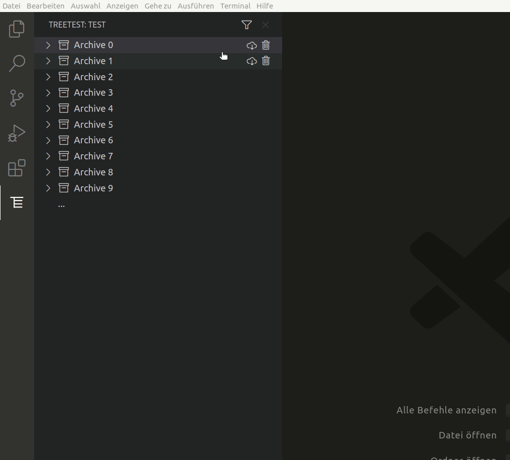

# VSCode TreeView sample

This project showcases a more realistic interaction behavior with Visual Studio Code's TreeViews operating on top of some remote Web API. While the API itself is faked here, the tree itself allows for dynamically loading additional nodes into the tree, filtering the tree for certain terms and conditions and downloading and opening files represented by nodes in the tree.

## Features

- Dynamically loading of new nodes
- Deleting nodes
- Filtering results and reloading treeview with updated nodes
- Downloading and opening files

